# Table & Vine

### My Restaurant Booking system

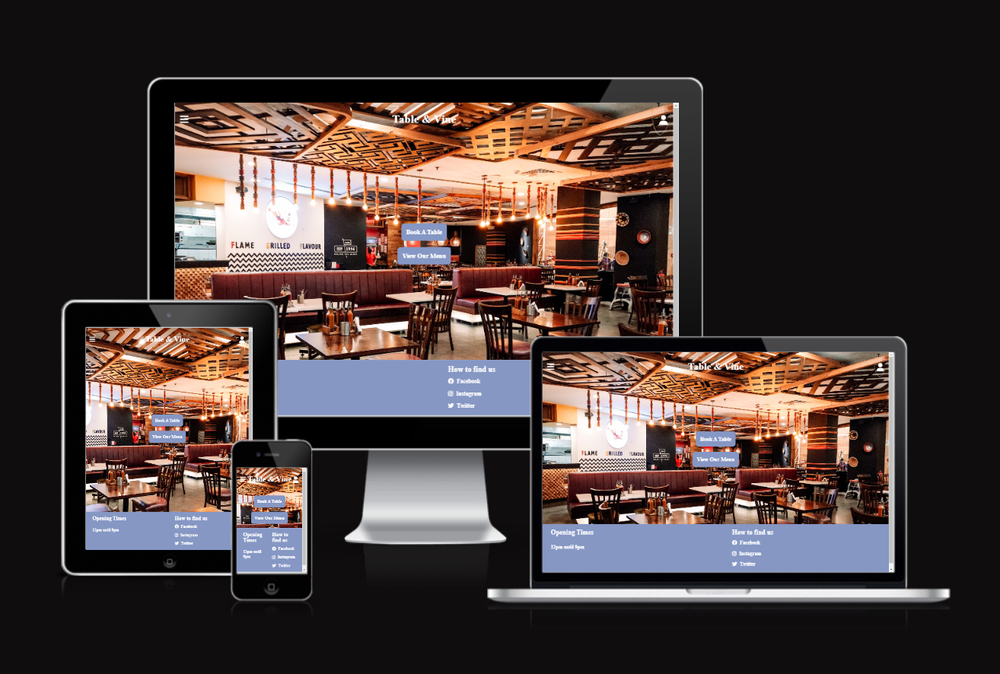

Portfolio 4 project as part of the Diploma in Full Stack Software Development by Code Institute..
___

Table & Vine is a restaurant booking website that allows customers to reserve a table for a specific date and time. They can also bring their friends along and explore the menu in advance to decide if it's the perfect spot for their booking.

Table & Vine is a full-stack restaurant booking system that allows users to reserve tables, create an account, and manage their bookings. Customers can also explore the menu and plan their visit with friends.

Link to live site - https://restaurant-booking-project-3f4ea4b60766.herokuapp.com/

## CONTENTS

  - [Site Objectives](#site-objectives)
- [User Experience/UX](#user-experienceux)
  - [Target Audience](#target-audience)
  - [User Stories](#user-stories)
    - [New Visitor Goals](#new-visitor-goals)
    - [Existing Visitor Goals](#existing-visitor-goals)
- [Design Choices](#design-choices)
  - [Colour Scheme](#colour-scheme)
  - [Typography](#typography)
  - [Logo and Favicon](#logo-and-favicon)
  - [Wireframes](#wireframes)
  - [Database Plan](#database-plan)
- [Features](#features)
  - [Registration](#registration)
  - [Future Features](#future-features)
- [Technologies Used](#technologies-used)
- [Programming Languages, Frameworks and Libraries Used](#programming-languages-frameworks-and-libraries-used)
- [Agile](#agile)
  - [Deployment](#deployment)
    - [Github Deployment](#github-deployment)
    - [Creating a Fork or Copying](#creating-a-fork-or-copying)
    - [Clone](#clone)
    - [Repository deployment via Heroku](#repository-deployment-via-heroku)
    - [Deployment of the app](#deployment-of-the-app)
  - [Credits](#credits)
  - [Media](#media)
  - [Acknowledgments and Thanks](#acknowledgments-and-thanks)

___

## Site Objectives

Build a full-stack restaurant booking system to develop and demonstrate a growing understanding of Django, PostgreSQL, and front-end development.

My three main objectives were:

- ### Create a readable, clean and responsive front end

  I designed a user-friendly interface that is easy to navigate and works across different devices. The front end was built using Django, HTML, and CSS, with a small amount of JavaScript to enhance interactivity and improve the user experience.

- ### Make use of available backend functionality

  The backend framework allows users to create an account, book a table, edit their booking, and delete it if needed. It also ensures double booking prevention and validates user input for a smooth booking experience.

- ### Store data on an external cloud database

  I used NeonDB to store the PostgreSQL database for this project.

___

# User Experience/UX

## Target Audience

- Individuals, couples, and groups who want a seamless way to plan their restaurant visit without hassle.

## User Stories

### New Visitor Goals

- Easily navigate the site with a clear and responsive design.
- Browse the restaurant menu, including prices and descriptions.
- View menu categories.
- Ensure accessibility with descriptive alt text for images.
- Create an account to book and manage reservations.

### Existing Visitor Goals

- Log in and out of their account.
- Book a table by selecting a date, time, and number of guests.
- Show Available Time Slots for Booking
- Receive confirmation after successfully booking a table.
- Edit or cancel existing reservations if plans change.
- Prevent double bookings to avoid conflicts in reservations.
- Secure login/logout required to view reserved tables.

___

# Design Choices

## Colour Scheme

The project uses soft blue for buttons, headers, and the footer, with white text for readability. This combination creates a simple and modern look while keeping the design clean and easy to navigate.

## Typography

I used poppins for the header across all pages [Poppins](https://fonts.google.com/specimen/Poppins)

## Logo and Favicon

The logo was created using an online logo creator - [favicon](https://favicon.io/)

## Wireframes

- Mobile Homepage Wireframe

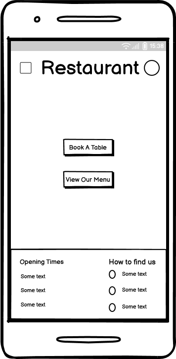

- Mobile Booking Page Wireframe

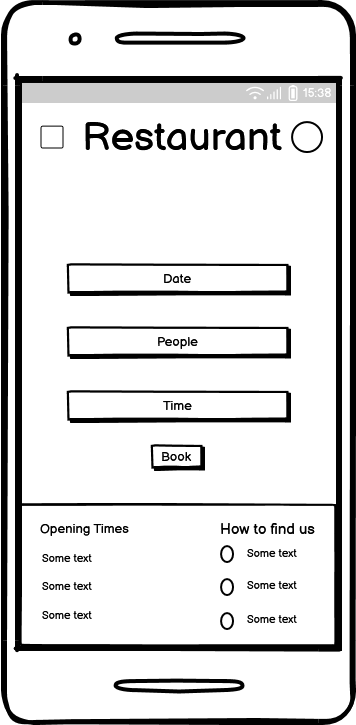

- Mobile Menu Page Wireframe

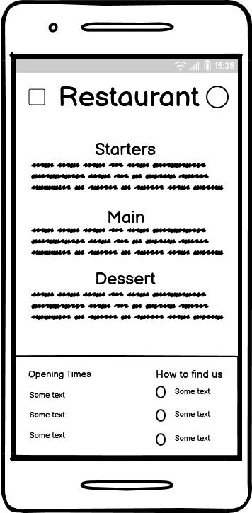

- Desktop Homepage Wireframe

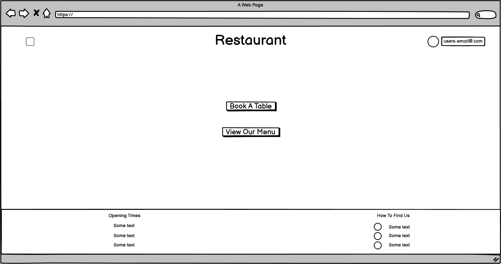

- Desktop Booking Wireframe

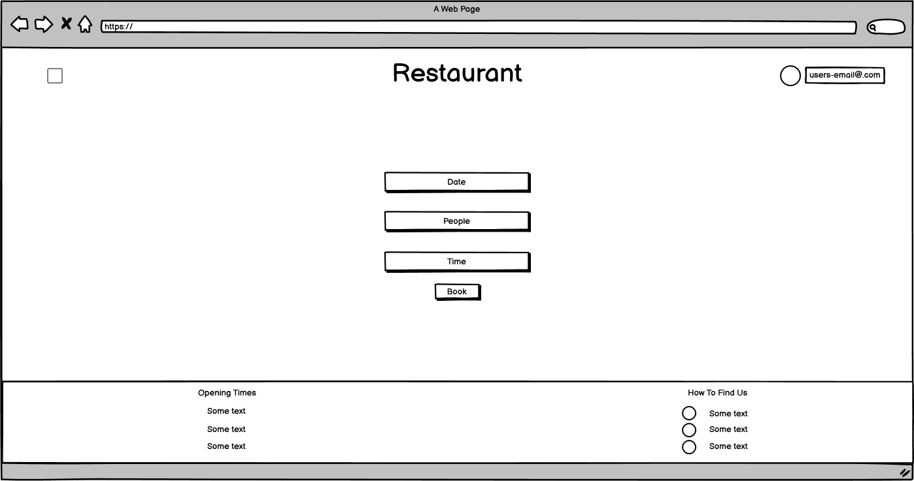

- Desktop Menu Wireframe

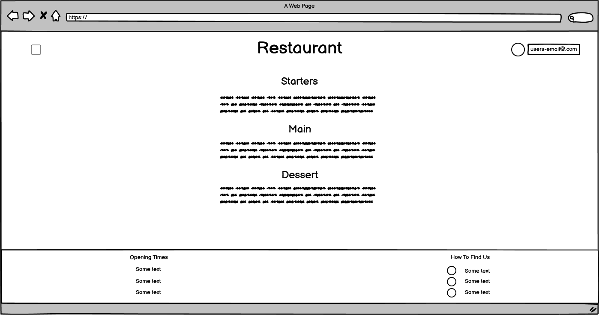

## Database Plan

This diagram shows how the database is structured for the restaurant booking system.

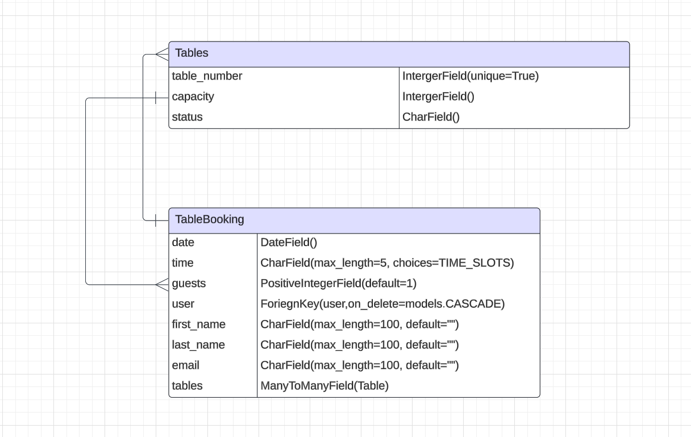

# Features

## Registration

The user can create an account (Not the nicest looking signup form currently, but it does serve its purpose)

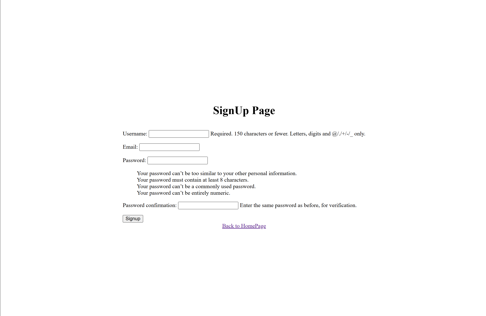

Login Page (Again not the nicest but it does do its job)

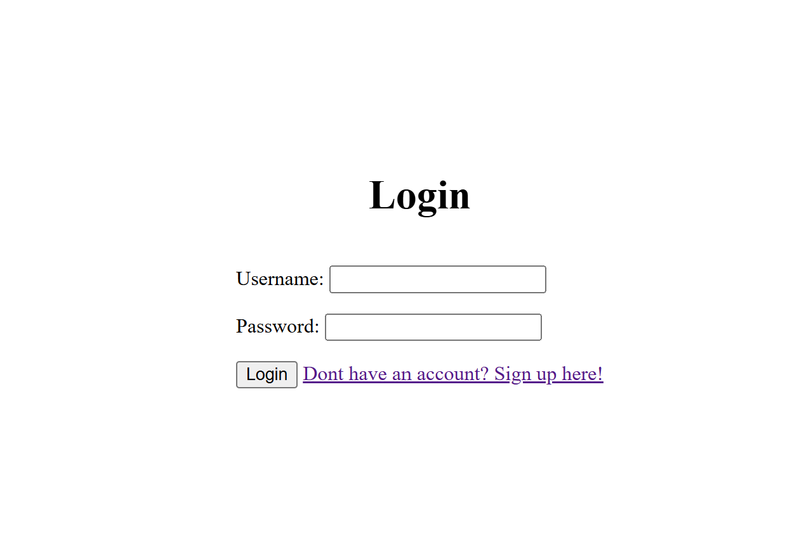

View the home page

View Menu 

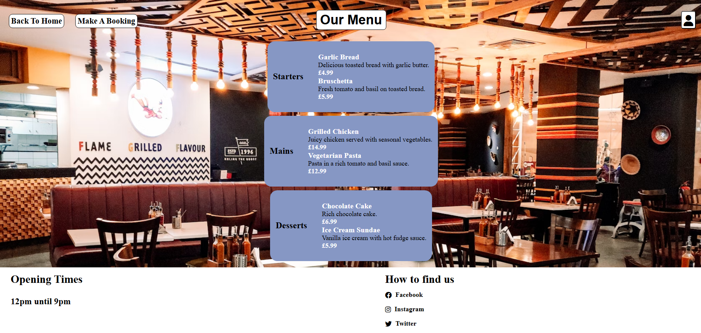

Make a booking

## Future Features

- Style login page
- Style Signup page
- User can request a password reset
- More menu items
- View Available times

___

# Technologies Used

Here are the technologies used to build this project:

- [VS Code](https://code.visualstudio.com/) To build and create this project
- [Github](https://github.com) To host and store the data for the site.
- [Heroku](https://www.heroku.com/) Used to deploy the project.
- [Flake8 PEP8 Validator](https://flake8.pycqa.org/) Used to check Python code for PEP 8 compliance and errors.
- [NeonDB](https://neon.tech/) Used to store PostgreSQL database.
- [Google Fonts](https://fonts.google.com/) Used for Typography.
- [Font Awesome](https://fontawesome.com/) Used for icons.
- [Gitpod](https://www.gitpod.io/) Used as an online development environment.

# Programming Languages, Frameworks and Libraries Used

- [HTML](https://developer.mozilla.org/en-US/docs/Web/HTML)
- [CSS](https://developer.mozilla.org/en-US/docs/Web/CSS)
- [JavaScript](https://developer.mozilla.org/en-US/docs/Web/JavaScript)
- [Python](https://developer.mozilla.org/en-US/docs/Learn/Getting_started_with_the_web/Python_basics)
- [Django](https://www.djangoproject.com/)

# Agile

This project was developed following the Agile methodology, making use of GitHub’s Project Board and Issues sections for task management and tracking.

- [Project Board](https://github.com/users/ashley9368/projects/4)

## Deployment

### Github Deployment

The website was stored on GitHub for data storage and version control. To achieve this, I followed these steps:

After adding, modifying, or removing code, I used the terminal in my IDE (Gitpod for this project) and ran the following commands:

- git add .
- git commit -m "meaningful commit message"
- git push

This made sure that all changes were saved and made available in my GitHub repository.

### Creating a Fork or Copying

To clone/fork/copy the repository you click on the fork tab which is situated next to unwatch tab in the top right corner of the page

### Clone

To create a clone you do the following;

1. Go to the github repository you want to clone.
2. Click the code button near the top right of the repository page.
3. Copy the repository URL by clicking the clipboard icon.
4. Open gitpod and open a new terminal
5. Type git clone (Then the repository url)
6. Type cd (repository name) to open the cloned project

### Repository deployment via Heroku

- On the [Heroku Dashboard](https://dashboard.heroku.com) page, click New and then select Create New App from the drop-down menu.
- When the next page loads insert the App name and Choose a region. Then click 'Create app'
- In the settings tab click on Reveal Config Vars and add the following credentials. The credentials for this app are:

1. DATABASE_URL
2. SECRET_KEY
3. DISABLE_COLLECTSTATIC

### Deployment of the app

- Go to the deploy tab and select github as the deployment method.
- Connect your github account and search for your repository.
- Select the repository that contains the project files and click connect.
- Choose manual deployment to deploy when you want to.
- Click deploy to start building the app
- Once the deployment has finished click open app
___

## Credits

Django Documentation And Python Documentation: The official Django and Python documentation was incredibly helpful during the build of this project [Django](https://docs.djangoproject.com/en/4.2/)

- https://docs.djangoproject.com/en/4.2/topics/db/models/
- https://docs.djangoproject.com/en/4.2/topics/forms/
- https://docs.djangoproject.com/en/4.2/topics/http/views/
- https://docs.python.org/3/tutorial/controlflow.html#defining-functions
- https://docs.djangoproject.com/en/4.2/topics/auth/default/
- https://docs.djangoproject.com/en/4.2/topics/db/queries/
- https://www.youtube.com/watch?v=s5xbtuo9pR0&t=267s
- https://www.w3schools.com/howto/howto_js_dropdown.asp#:~:text=Example%20Explained,dropdown%20menu%20correctly%20with%20CSS.

To help me gain a better understanding on erds

- https://www.youtube.com/watch?v=xsg9BDiwiJE

The Readme layout was based on the example by [Readme Example](https://github.com/markdaniel1982/MD82-P4/blob/main/README.md)

The wireframe mockups were created using [Balsamiq](https://balsamiq.com/)

___

## Media

I only used one image for my website, Which was the background for the restaurant.

[Background Image](https://unsplash.com/photos/a-restaurant-filled-with-wooden-tables-and-chairs-vDlt9BQND-o)

___

## Acknowledgments and Thanks

- Jubril Akolade / My Mentor
- Roman / Code Institute Tutor
- Rebecca / Code Institute Tutor