# Testing

Throughout the development of this project, I tested each feature as I built it to ensure functionality and styling worked correctly. I checked for issues with user authentication, form validation, database interactions, and responsiveness across different screen sizes. I did go back at times to fix issues i felt like would be better to go back to later.

## Manual Testing

## User

| TEST | OUTCOME | PASS/FAIL|
|:---:|:---:|:---:|
| User Signup | User successfully registered and added to the database | Pass |
| User Login | User logged in successfully and redirected correctly | Pass |
| User Logout | User logged out and session cleared | Pass |
| Book a table | Booking successfuly created and stored in the database | Pass |
| Edit a booking | Booking details updated correctly | Pass |
| Cancel editing a booking | User can exit editing mode without changes being saved | Pass |
| Delete a booking | Booking successfully removed from the system | Pass |
| Mobile responsiveness | Booking system and navigation work propery on different screen sizes | Pass |

## Bugs

During the development of this website i had many occasions where bugs would appear or i simply just had typos or just genuinely forgot, They caused issues but i just went back and read what wasn't working line by line to refine the potential issues.

While editing a booking, I realised there was no option to exit without saving changes if i changed my mind. So i added a cancel button that doesn't save changes to the form so the user could exit without hassle.

I encountered an issue where the success messages were not displaying properly when editing the booking and saving the changes. The issue was that i forgot to add the message display logic to the booking.html once i included it the messages appeared as expected.

## Lighthouse

Mobile Lighthouse Scores

Homepage

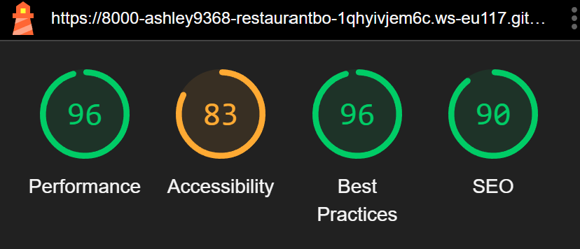

Booking

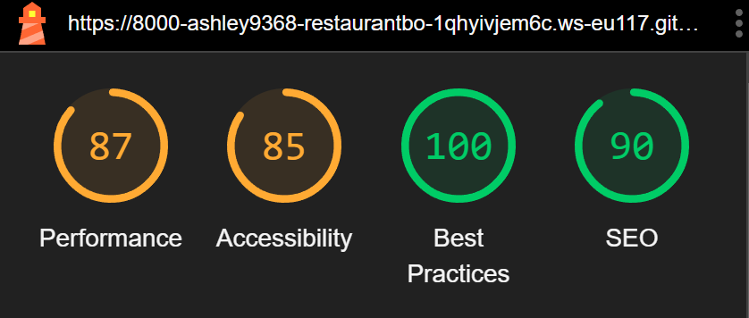

Login

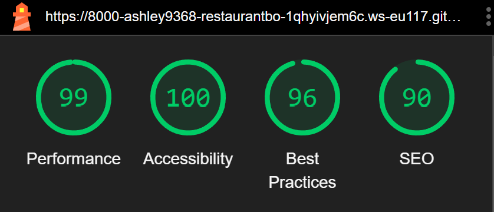

Manage Booking

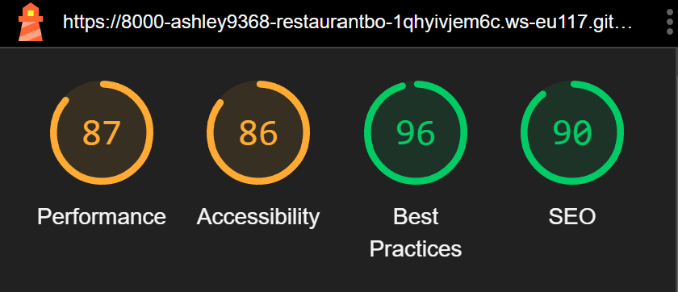

Menu Score

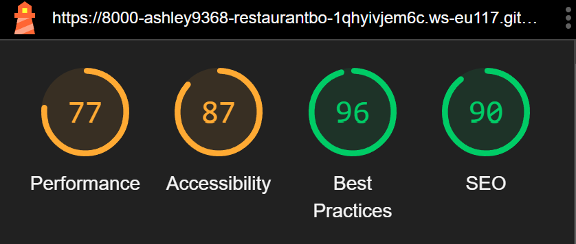

Signup Score

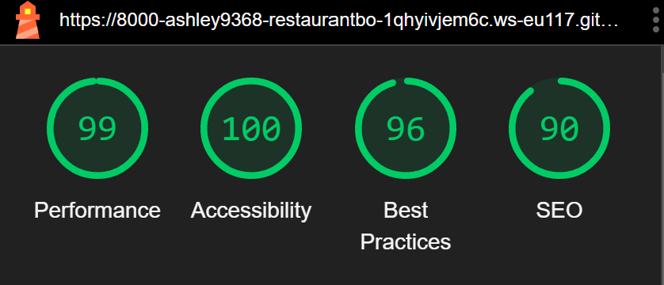

Desktop Lighthouse Scores

Homepage

Booking

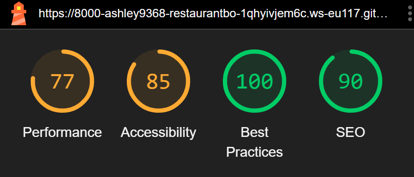

Login

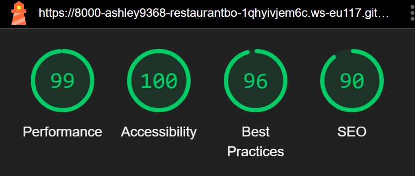

Manage Booking

Menu Score

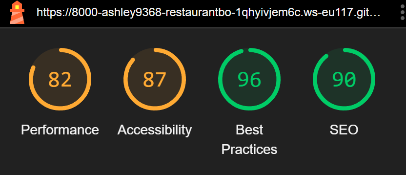

Signup Score

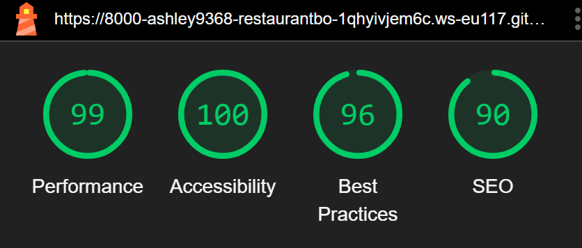

## Validation Testing

### HTML & CSS

HTML & CSS testing was completed using [W3 Validator](https://validator.w3.org/)

Homepage w3c validation

Booking w3c validation

Login w3c validation

Manage Booking w3c validation

Menu w3c validation

There are a couple of errors on the signup page but i am unsure how to fix them unfortunately.

Signup w3c validation

Css was tested using the W3C CSS Validation service 

[https://jigsaw.w3.org/css-validator/]

Passed with 1 warning
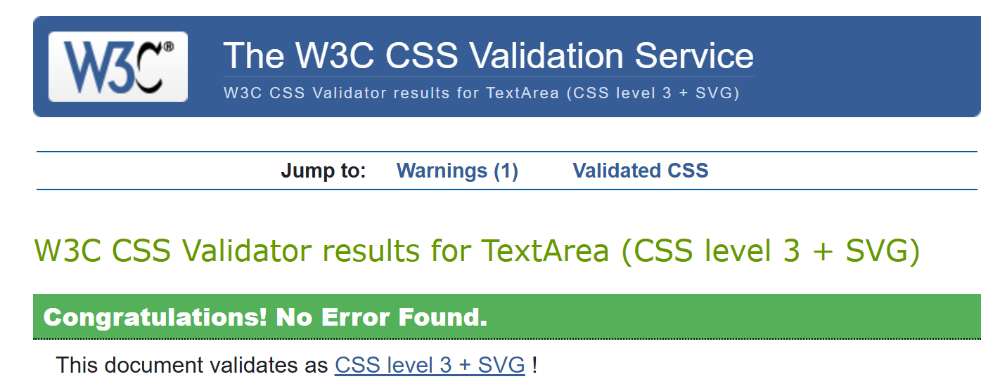

## Python Testing

I validated my python code using Flake8 [Flake8](https://flake8.pycqa.org/en/latest/)

During the validation, I came across some issues, Like trailing whitespace, lines to long exceeding 79 characters, and unused imports. I have no fixed these errors to make sure the code follows PEP8 standards

Python Files Tested:

- models
- forms
- views
- urls

___